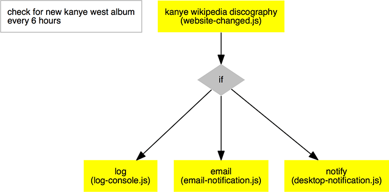

# causality

> an automation tool

## similar tools:
- [ifttt](https://ifttt.com/)
- [huginn](https://github.com/cantino/huginn)
- [node-red](http://nodered.org/)
- [workflow](https://workflow.is/)

---

## installation

requirements:
- [node.js](http://nodejs.org/)
- [git](http://git-scm.com/)

```shell
npm install
mv config.js.example config.js
```

then edit `config.js` and fill in the `XXXXXXXXX`s.

---

## run

```shell
node index.js
```

if you want to see [debug](https://www.npmjs.com/package/debug) messages:

```shell
DEBUG=-express:* node index.js
```

or use [nodemon](http://nodemon.io/), [forever](https://github.com/foreverjs/forever), ...

---

## built-in blocks

---

## examples

