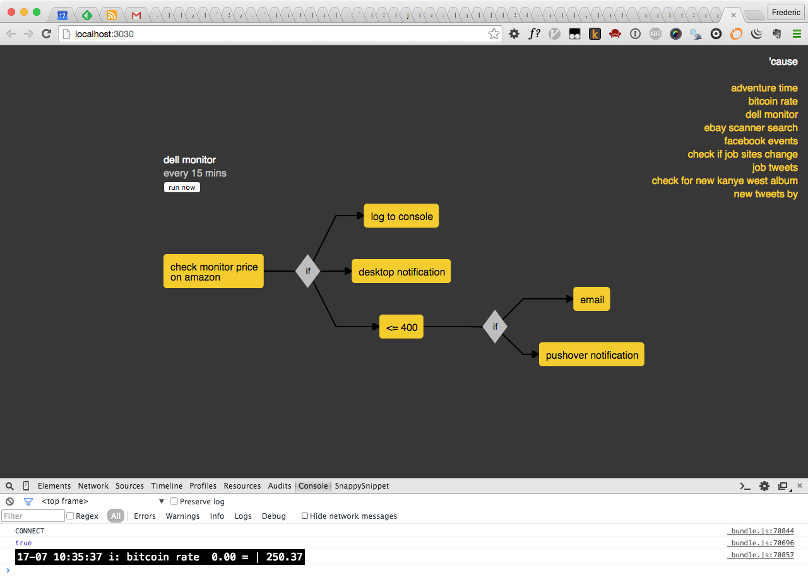

# 'cause

> an automation tool


---


## installation

requirements:
- [`node.js`](http://nodejs.org/)
- [`git`](http://git-scm.com/)

```shell
git clone https://github.com/freder/cause.git
cd cause
npm install
mv config.js.example config.js
```

then edit `config.js` and fill in the `XXXXXXXXX`s.


---


## run

```shell
node index.js
```

if you want to see [`debug`](https://www.npmjs.com/package/debug) messages:

```shell
DEBUG=cause:* node index.js
```


---


## web frontend

as you start the tool, it opens the web frontend in the browser.




---


## [`built-in blocks`](./blocks/)


---


## tasks

task configuration files live in `tasks/`. [`tasks/examples/`](./tasks/examples/) contains a few examples.

---


## cool examples

TODO:


---


# writing your own blocks

check out [`cause-website-changed`](https://github.com/freder/cause-website-changed/blob/master/cause-website-changed.js) for a documented example.


---


# versions
- `0.9.0`
	+ blocks: removed all dependencies on `cause`, so that they can be stand-alone npm modules


---


## similar tools:
- [`ifttt`](https://ifttt.com/)
- [`huginn`](https://github.com/cantino/huginn)
- [`node-red`](http://nodered.org/)
- [`workflow`](https://workflow.is/)
